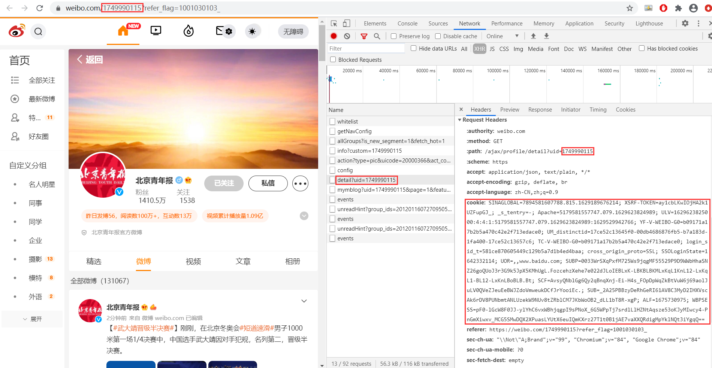

# 批量下载微博高清原图的代码
### 本代码用Python写的，需要电脑预装Python。
### 需要被爬取的微博账号开放了相册一栏。
## 使用方法：
### 1.先修改userinfo，用记事本打开，修改userName、uid、referer、cookie、downloadDirRoot。
#### 注：userName只是为了保存在指定文件夹下，downloadDirRoot为指定根目录，取什么名字与下载无关。
### 2.进入你要爬取的微博账号，按F12，点击进入相册一栏，点击右侧Network下的Name栏的getImageWall一栏，获取uid、referer、cookie。
### 3.修改好userinfo文件后，在 爬取微博图片.py 文件的同目录下，空白处按住shift并右击，输入python 爬取微博图片.py（可复制后右击可以粘贴），回车运行即可。
### 

## 与其它软件的比较：
### 有的软件是相当于用游客身份访问，这样有个弊端，有的微博账号某些内容只对粉丝开放，这样用游客身份访问就无法下载。所以想访问这些内容还是需要用你的账号通过cookie访问。
### 有的软件一条状态最多只能下载9张图，但是现在微博一条状态最多能发18张图。
### 有的软件命名用1、2、3、4……这样，但是如果账号更新后再下载，原来的图名称就不一样了，不利于管理。
### 本代码避免了上面的问题。

## 注：cookie必须实时更新，有一段时间不访问cookie就会失效。
